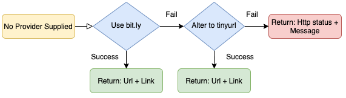

# &nbsp;&nbsp;&nbsp;Shorty

A Url shortener API.

# Design

This document describes the implementation details of the `Shorty` and the main design choices.

#### Details

The HTTP variant uses Flask framework with pytest for unit and integration testing. The shorty api supports a simple `POST` operation 
that simply requests a url shortening from an external provider - api. The REST interface is roughly the following:

* `POST /shortlinks`

#### Recipe

After the POST request the worker recipe is doing the following:

* The first code block validates the requested parameters considering the typos and the url validation. If the handler finds a typo in one of the two 
parameters returns a `400` http status followed by a proper message which asks from the user to provide the proper parameters. On the other hand, if 
the provided url is invalid returns a `404` http status followed by a proper message which asks from the user to provide a valid url. If request data
are valid then the handler returns the corresping message and continues.

Typos Validation:
```json
{
    "status_code": 400,
    "message": "Invalid parameters. Provide a <url> and optionally a <provider> parameter."
}
```

Url Validation:
```json
{
    "status_code": 404,
    "message": "Invalid Url. Please provide a valid url"
}
```

* If validator confirms that requested data are valid and a provider is supplied then the handler instantiates the corresponding class attributes 
and makes the proper post request based on the supplied provider. If the response http status is not 200 or 201 then the handler returns the 
corresponding http status code with its default message. In case of successfull response the handler returns a json with the requested `url` and the
corresponding `link`. If the supplied provider does not match the supported ones then the handler return a `404` http status with a proper 
message which asks from the user to choose between `bit.ly` and `tinyurl`.

Successful response - tinyurl:
```json
{
    "url": "https://www.example.com",
    "link": "https://tinyurl.com/cru6j"
}
```
Successful response - bit.ly:
```json
{
    "url": "https://www.example.com",
    "link": "https://bit.ly/2NQRQwO"
}
```
Failed response - 404:
```json
{
    "status_code": 404,
    "message": "Not Found"
}
```
Failed response - Timeout:
```json
{
    "status_code": 408,
    "message": "Request Timeout"
}
```
Unknown Provider:
```json
{
    "status_code": 404,
    "message": "Not supported Provider. Choose between bit.ly and tinyurl"
}
```

* If validator confirms that requested data are valid and a provider is not supplied then the handler instantiates the corresponding class attributes 
and makes the proper post request for the `bit.ly` provider. If the response http status is not successful then the handler alters the provider to 
`tinyurl` and repeats the procedure. If the response http status is again not successful then the handler returns the corresponding http status code with 
its default message. For both cases, the successfull response returns a json with the requested `url` and the corresponding `link`.


# &nbsp;&nbsp;&nbsp;Fallback design


